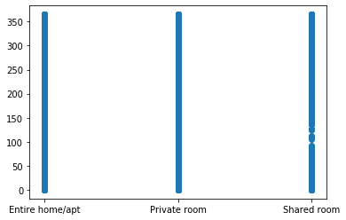
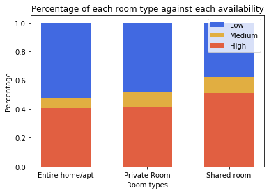

# Exploring the Airbnb London Listings dataset 
This jupyter notebook will start by exploring some simple questions about the types of listings in london.

Firstly, importing pandas, numpy, and the dataset.


```python
import pandas as pd
import numpy as np
import matplotlib.pyplot as plt
airbnb = pd.read_csv('data/listings.csv', low_memory=False, header=0)
#list(airbnb.columns) 
```

Airbnb hosts can list entire homes/apartments, private or shared rooms.

Private rooms are more like hotels, and a shared room more like a hostel. This could be disruptive to neighbourhoods, as Airbnb has said: 'Depending on the room type, availability, and activity, an airbnb listing could be more like a hotel, disruptive for neighbours, taking away housing, and illegal.'


```python
airbnb_room_type = airbnb.groupby(['room_type']).count()['id']
print(airbnb_room_type)
```

    room_type
    Entire home/apt    45065
    Private room       34964
    Shared room          738
    Name: id, dtype: int64


We therefore get, a count of 45065 for entire home or appartment, 34964 for Private Room, and 738 for share rooms. 

But it would be useful to know the proportion of these that are of each category. 


```python
percent_room_type = airbnb_room_type/(airbnb['room_type'].count())
print(percent_room_type)
```

    room_type
    Entire home/apt    0.557963
    Private room       0.432900
    Shared room        0.009137
    Name: id, dtype: float64


We therefore see that the largest proportion of listings, 56% are for entire home of apartments, followed by 43% of the listings that are for private rooms, and finally 1% of the listings that are for shared rooms. 

Other important information, include the fact that Airbnb, has stated that: 'Entire homes or apartments highly available year-round for tourists, probably don't have the owner present, could be illegal, and more importantly, are displacing residents.' It would be interesting to observe, how many of the listings are available all year round, and what room type these often are. Airbnb define the following goupings based on the level of availability the listing has: 

- Low availability 0-60 days a year
- Medium availability 60-90 days a year
- High availability 90-365 days a year

This next section will work out the percentage of the listings that fall into each of these categories. 


```python
# calculate what percentage/count of listings are 
# highly avialable > 90 days. 
listings = airbnb['id'].count()
availability = airbnb['availability_365']
availability_count = availability.count()

print("Total Number of Listings: " + str(listings))

def get_availability(x):
    return airbnb[x]['id']

availability_low = get_availability(availability <= 60)
availability_medium = get_availability((availability <= 90) & (availability > 60))
availability_high = get_availability(availability > 90)

print("Low Availability Count:", str(availability_low.count()))
print("Medium Availability Count:", str(availability_medium.count()))
print("High Availability Count:", str(availability_high.count()))

def calculate_percent(x):
    x = x/listings
    return x

print("Low Availability Percent:", str(calculate_percent(availability_low).count()))
print("Medium Availability Percent:", str(calculate_percent(availability_medium).count()))
print("High Availability Percent:", str(calculate_percent(availability_high).count()))
     
```

    Total Number of Listings: 80767
    Low Availability Count: 40557
    Medium Availability Count: 6958
    High Availability Count: 33252
    Low Availability Percent: 40557
    Medium Availability Percent: 6958
    High Availability Percent: 33252


Scatter plot, to see if there is any clustering, as in is one type of room more likely to be at one end of the graph (e.g. is shared room less availabile, than a private room etc.)


```python
plt.scatter(airbnb['room_type'], availability)
```


    <matplotlib.collections.PathCollection at 0x12cfced68>





We don't see much in the scatter plot. Maybe some grouping in 'Shared room', but all the others appear to have continuous availabiity. 

We can check this statistically, and see what percentage of each room type, entire/private/shared that fall into each of the availability categories. If high avialability on differnet room types may cause different amounts of disturbance for the local neighbourhoods. High vailability on entire listing could lead to a lack of housing avialability, and high avialability of private rooms may lead to a business in a hotel style enviroment. 


```python
#calculate the percentage of each room type that has each type of availability

def percent_availability(roomtype, availability):
    all_listings = airbnb[airbnb.room_type == roomtype]
    filtered_listings = all_listings[all_listings['id'].isin(availability)]['id']
    return (filtered_listings.count()/all_listings.count())['id']

def print_percent_availability(roomtype, availability, availability_label):
    percentage = percent_availability(roomtype, availability)
    print(roomtype + ' - ' + availability_label + ': ' + str(percentage))
    
print('Percentage of room type for each availability.')

print_percent_availability('Entire home/apt', availability_low, 'low')
print_percent_availability('Entire home/apt', availability_medium, 'medium')
print_percent_availability('Entire home/apt', availability_high, 'high')
print_percent_availability('Private room', availability_low, 'low')
print_percent_availability('Private room', availability_medium, 'medium')
print_percent_availability('Private room', availability_high, 'high')
print_percent_availability('Shared room', availability_low, 'low')
print_percent_availability('Shared room', availability_medium, 'medium')
print_percent_availability('Shared room', availability_high, 'high')

```

    Percentage of room type for each availability.
    Entire home/apt - low: 0.5218018417840896
    Entire home/apt - medium: 0.06858981471208254
    Entire home/apt - high: 0.4096083435038278
    Private room - low: 0.47943599130534265
    Private room - medium: 0.108254204324448
    Private room - high: 0.41230980437020937
    Shared room - low: 0.3780487804878049
    Shared room - medium: 0.1111111111111111
    Shared room - high: 0.510840108401084


This data would be easier to visualise in a stacked bar graph, visualised below. 


```python
room_types = ['Entire home/apt', 'Private Room', 'Shared room']
low_availability_values = np.array([percent_availability('Entire home/apt', availability_low), 
                           percent_availability('Private room', availability_low),
                           percent_availability('Shared room', availability_low)])
medium_availability_values = np.array([percent_availability('Entire home/apt', availability_medium),
                              percent_availability('Private room', availability_medium),
                              percent_availability('Shared room', availability_medium)])
high_availability_values = np.array([percent_availability('Entire home/apt', availability_high),
                            percent_availability('Private room', availability_high), 
                            percent_availability('Shared room', availability_high)])

ind = [x for x, _ in enumerate(room_types)]

plt.bar(ind, low_availability_values, width=0.6, label='Low', color='#4169E1', bottom=medium_availability_values+high_availability_values)
plt.bar(ind, medium_availability_values, width=0.6, label='Medium', color='#e1ae41', bottom=high_availability_values)
plt.bar(ind, high_availability_values, width=0.6, label='High', color='#e15f41')

plt.ylabel('Percentage')
plt.xlabel('Room types')
plt.title('Percentage of each room type against each availability')

plt.xticks(ind, room_types)
plt.legend(loc='upper right')
plt.show()
```





Want to know if high availability properties effect the availability of housing in certain post-code zones in london. 

--- so first see which post code zones have high availability of entire home/apt. 
--- then are these post code areas affecting the availability of housing. 


```python
import re

postcode_area_regex = re.compile("(?P<zipcode>[A-Z]{1,2}\d[A-Z\d]?)")

def GroupColFunc(df, ind, col):
    result = postcode_area_regex.search(str(df[col].loc[ind]))
    
    if result is None:
        return "Unknown"
    
    return result.group(1)

# print(airbnb['zipcode'].loc[0])

# postcodes = airbnb['zipcode'].str.extract(r'(?P<zipcode>[A-Z]{1,2}\d[A-Z\d]?)')

airbnb_zipcode_area = airbnb.groupby(lambda x: GroupColFunc(airbnb, x, 'zipcode')).count()['id']

#airbnb_zipcode_area = airbnb_zipcode_area.loc[airbnb[count] >= 10]

print(airbnb_zipcode_area.sort_values(ascending=False))
```

    E1         2964
    W2         2740
    Unknown    2696
    N1         2667
    E2         2074
    NW1        1998
    SE1        1955
    E14        1659
    SW6        1458
    SW11       1386
    E8         1354
    NW6        1220
    W14        1139
    N16        1017
    E3          966
    W9          943
    NW10        927
    N7          905
    SW1V        899
    SW18        898
    NW3         881
    SW19        857
    SW3         854
    SW5         832
    E5          822
    SE16        817
    W11         807
    W12         801
    SW7         799
    N4          786
               ... 
    HA97          1
    NW15          1
    NW21          1
    SM54          1
    E70           1
    SM52          1
    SM38          1
    SM13          1
    SL3           1
    HA87          1
    SE91          1
    SE58          1
    SE41          1
    SE39          1
    E61           1
    RM53          1
    E77           1
    NW22          1
    E78           1
    RM30          1
    RH13          1
    PE20          1
    NW96          1
    NW95          1
    NW87          1
    NW74          1
    NW66          1
    NW61          1
    NW36          1
    AL3           1
    Name: id, Length: 463, dtype: int64


Want to see the proportion of high availability in each of these post codes. 


```python
def percent_availability_by_zip(roomtype, availability, zipcode):
    all_listings = airbnb[(airbnb.room_type == roomtype) & (airbnb.zipcode.str.startswith(zipcode))]
    filtered_listings = all_listings[all_listings['id'].isin(availability)]['id']
    return (filtered_listings.count()/all_listings.count())['id']

def print_percent_availability_by_zip(roomtype, availability, zipcode, availability_label):
    percentage = percent_availability_by_zip(roomtype, availability, zipcode)
    print(roomtype + ' - ' + availability_label + ' - ' + zipcode + ': ' + str(percentage))
    
for items in airbnb_zipcode_area.iteritems():
    print_percent_availability_by_zip('Entire home/apt', availability_high, items[0], 'High')
```

    Entire home/apt - High - AL3: 1.0
    Entire home/apt - High - BN3: nan
    Entire home/apt - High - BR1: 0.55
    Entire home/apt - High - BR2: 0.5185185185185185
    Entire home/apt - High - BR3: 0.6041666666666666
    Entire home/apt - High - BR35: nan
    Entire home/apt - High - BR4: 0.5
    Entire home/apt - High - BR49: nan
    Entire home/apt - High - BR5: 0.9264705882352942
    Entire home/apt - High - BR6: 0.6
    Entire home/apt - High - BR7: 0.7142857142857143
    Entire home/apt - High - BT15: 0.0
    Entire home/apt - High - CR0: 0.49748743718592964
    Entire home/apt - High - CR01: 1.0
    Entire home/apt - High - CR02: 1.0
    Entire home/apt - High - CR06: nan
    Entire home/apt - High - CR07: nan
    Entire home/apt - High - CR08: nan
    Entire home/apt - High - CR2: 0.5555555555555556
    Entire home/apt - High - CR4: 0.5588235294117647
    Entire home/apt - High - CR43: 1.0
    Entire home/apt - High - CR5: 0.8
    Entire home/apt - High - CR7: 0.34782608695652173
    Entire home/apt - High - CR8: 0.6666666666666666
    Entire home/apt - High - CR9: 0.8
    Entire home/apt - High - CV34: 1.0
    Entire home/apt - High - DA1: 0.6538461538461539
    Entire home/apt - High - DA14: 0.75
    Entire home/apt - High - DA15: 0.6
    Entire home/apt - High - DA16: 0.6666666666666666
    Entire home/apt - High - DA17: 0.5
    Entire home/apt - High - DA18: nan
    Entire home/apt - High - DA5: 0.25
    Entire home/apt - High - DA6: 0.25
    Entire home/apt - High - DA7: 0.8
    Entire home/apt - High - DA8: 0.625
    Entire home/apt - High - DE4: nan
    Entire home/apt - High - E1: 0.4241370082954241
    Entire home/apt - High - E10: 0.384
    Entire home/apt - High - E11: 0.3575757575757576
    Entire home/apt - High - E12: 0.23809523809523808
    Entire home/apt - High - E13: 0.3877551020408163
    Entire home/apt - High - E14: 0.47904191616766467
    Entire home/apt - High - E15: 0.4369747899159664
    Entire home/apt - High - E16: 0.528125
    Entire home/apt - High - E17: 0.2787456445993031
    Entire home/apt - High - E18: 0.41379310344827586
    Entire home/apt - High - E1W: 0.2934131736526946
    Entire home/apt - High - E2: 0.32701421800947866
    Entire home/apt - High - E20: 0.4888888888888889
    Entire home/apt - High - E22: nan
    Entire home/apt - High - E25: nan
    Entire home/apt - High - E26: 0.0
    Entire home/apt - High - E27: 0.2857142857142857
    Entire home/apt - High - E28: 1.0
    Entire home/apt - High - E29: 0.0
    Entire home/apt - High - E3: 0.2318840579710145
    Entire home/apt - High - E32: 0.0
    Entire home/apt - High - E33: 0.5
    Entire home/apt - High - E34: nan
    Entire home/apt - High - E35: 0.0
    Entire home/apt - High - E4: 0.48
    Entire home/apt - High - E49: nan
    Entire home/apt - High - E5: 0.22429906542056074
    Entire home/apt - High - E50: 0.0
    Entire home/apt - High - E58: 0.0
    Entire home/apt - High - E59: 0.3333333333333333
    Entire home/apt - High - E6: 0.43333333333333335
    Entire home/apt - High - E61: nan
    Entire home/apt - High - E7: 0.37777777777777777
    Entire home/apt - High - E70: nan
    Entire home/apt - High - E77: 1.0
    Entire home/apt - High - E78: nan
    Entire home/apt - High - E79: nan
    Entire home/apt - High - E8: 0.22386058981233245
    Entire home/apt - High - E81: 0.6666666666666666
    Entire home/apt - High - E82: 0.3333333333333333
    Entire home/apt - High - E83: 0.0
    Entire home/apt - High - E84: 0.5
    Entire home/apt - High - E9: 0.25396825396825395
    Entire home/apt - High - E95: 0.0
    Entire home/apt - High - E96: 1.0
    Entire home/apt - High - EC1: 0.4393358876117497
    Entire home/apt - High - EC1A: 0.7142857142857143
    Entire home/apt - High - EC1M: 0.5789473684210527
    Entire home/apt - High - EC1N: 0.453125
    Entire home/apt - High - EC1R: 0.31875
    Entire home/apt - High - EC1V: 0.4197183098591549
    Entire home/apt - High - EC1Y: 0.375
    Entire home/apt - High - EC2A: 0.43902439024390244
    Entire home/apt - High - EC2M: 0.42105263157894735
    Entire home/apt - High - EC2N: 1.0
    Entire home/apt - High - EC2R: nan
    Entire home/apt - High - EC2V: 1.0
    Entire home/apt - High - EC2Y: 0.15384615384615385
    Entire home/apt - High - EC3: 0.4946236559139785
    Entire home/apt - High - EC3A: 0.8333333333333334
    Entire home/apt - High - EC3N: 0.5166666666666667
    Entire home/apt - High - EC3R: 0.45454545454545453
    Entire home/apt - High - EC3V: 0.0
    Entire home/apt - High - EC4A: 0.6842105263157895
    Entire home/apt - High - EC4M: 0.6
    Entire home/apt - High - EC4N: 0.6
    Entire home/apt - High - EC4R: 0.5555555555555556
    Entire home/apt - High - EC4V: 0.5333333333333333
    Entire home/apt - High - EC4Y: 0.8333333333333334
    Entire home/apt - High - EI62: nan
    Entire home/apt - High - EN1: 0.64
    Entire home/apt - High - EN2: 0.8064516129032258
    Entire home/apt - High - EN3: 0.6666666666666666
    Entire home/apt - High - EN4: 0.23529411764705882
    Entire home/apt - High - EN48: nan
    Entire home/apt - High - EN5: 0.5
    Entire home/apt - High - EN52: nan
    Entire home/apt - High - EN8: 0.0
    Entire home/apt - High - EN9: nan
    Entire home/apt - High - HA0: 0.3333333333333333
    Entire home/apt - High - HA1: 0.5254237288135594
    Entire home/apt - High - HA13: nan
    Entire home/apt - High - HA2: 0.4230769230769231
    Entire home/apt - High - HA3: 0.6666666666666666
    Entire home/apt - High - HA37: nan
    Entire home/apt - High - HA4: 0.631578947368421
    Entire home/apt - High - HA5: 0.6428571428571429
    Entire home/apt - High - HA6: 0.3333333333333333
    Entire home/apt - High - HA7: 0.7
    Entire home/apt - High - HA73: nan
    Entire home/apt - High - HA8: 0.41379310344827586
    Entire home/apt - High - HA87: nan
    Entire home/apt - High - HA9: 0.6285714285714286
    Entire home/apt - High - HA97: 1.0
    Entire home/apt - High - HA98: nan
    Entire home/apt - High - IG1: 0.4305555555555556
    Entire home/apt - High - IG11: 0.4634146341463415
    Entire home/apt - High - IG12: 0.0
    Entire home/apt - High - IG2: 0.42857142857142855
    Entire home/apt - High - IG3: 0.8
    Entire home/apt - High - IG38: nan
    Entire home/apt - High - IG4: 0.5
    Entire home/apt - High - IG5: 0.3333333333333333
    Entire home/apt - High - IG6: 0.75
    Entire home/apt - High - IG63: nan
    Entire home/apt - High - IG7: 0.16666666666666666
    Entire home/apt - High - IG8: 0.47368421052631576
    Entire home/apt - High - IG87: nan
    Entire home/apt - High - IG9: 0.0
    Entire home/apt - High - IW6S: nan
    Entire home/apt - High - KT1: 0.27450980392156865
    Entire home/apt - High - KT14: nan
    Entire home/apt - High - KT19: 0.0
    Entire home/apt - High - KT2: 0.3090909090909091
    Entire home/apt - High - KT25: nan
    Entire home/apt - High - KT27: 0.0
    Entire home/apt - High - KT3: 0.41379310344827586
    Entire home/apt - High - KT34: nan
    Entire home/apt - High - KT4: 0.2222222222222222
    Entire home/apt - High - KT5: 0.35294117647058826
    Entire home/apt - High - KT58: nan
    Entire home/apt - High - KT6: 0.3448275862068966
    Entire home/apt - High - KT7: 0.0
    Entire home/apt - High - KT8: 0.7857142857142857
    Entire home/apt - High - KT9: 0.6666666666666666
    Entire home/apt - High - N1: 0.29831209094040645
    Entire home/apt - High - N10: 0.3614457831325301
    Entire home/apt - High - N11: 0.373134328358209
    Entire home/apt - High - N12: 0.38636363636363635
    Entire home/apt - High - N13: 0.34146341463414637
    Entire home/apt - High - N14: 0.8076923076923077
    Entire home/apt - High - N15: 0.3779527559055118
    Entire home/apt - High - N16: 0.18631178707224336
    Entire home/apt - High - N17: 0.28205128205128205
    Entire home/apt - High - N18: 0.5555555555555556
    Entire home/apt - High - N19: 0.31759656652360513
    Entire home/apt - High - N1C: 0.4444444444444444
    Entire home/apt - High - N2: 0.3561643835616438
    Entire home/apt - High - N20: 0.35
    Entire home/apt - High - N21: 0.4
    Entire home/apt - High - N22: 0.375
    Entire home/apt - High - N3: 0.40476190476190477
    Entire home/apt - High - N32: nan
    Entire home/apt - High - N4: 0.2803738317757009
    Entire home/apt - High - N41: nan
    Entire home/apt - High - N42: nan
    Entire home/apt - High - N43: 0.0
    Entire home/apt - High - N44: nan
    Entire home/apt - High - N5: 0.26537216828478966
    Entire home/apt - High - N51: 0.0
    Entire home/apt - High - N52: 0.0
    Entire home/apt - High - N6: 0.35537190082644626
    Entire home/apt - High - N64: 1.0
    Entire home/apt - High - N65: 0.0
    Entire home/apt - High - N7: 0.2320754716981132
    Entire home/apt - High - N70: nan
    Entire home/apt - High - N76: nan
    Entire home/apt - High - N77: 1.0
    Entire home/apt - High - N78: 0.0
    Entire home/apt - High - N79: nan
    Entire home/apt - High - N8: 0.22085889570552147
    Entire home/apt - High - N80: 1.0
    Entire home/apt - High - N87: 1.0
    Entire home/apt - High - N88: nan
    Entire home/apt - High - N89: 0.3333333333333333
    Entire home/apt - High - N9: 0.5357142857142857
    Entire home/apt - High - N97: nan
    Entire home/apt - High - N98: 1.0
    Entire home/apt - High - NW1: 0.45569620253164556
    Entire home/apt - High - NW10: 0.4131455399061033
    Entire home/apt - High - NW11: 0.3372093023255814
    Entire home/apt - High - NW12: 1.0
    Entire home/apt - High - NW14: 0.0
    Entire home/apt - High - NW15: nan
    Entire home/apt - High - NW16: nan
    Entire home/apt - High - NW18: 1.0
    Entire home/apt - High - NW19: 0.0
    Entire home/apt - High - NW2: 0.43790849673202614
    Entire home/apt - High - NW21: 1.0
    Entire home/apt - High - NW22: 0.0
    Entire home/apt - High - NW23: 0.0
    Entire home/apt - High - NW3: 0.4383116883116883
    Entire home/apt - High - NW34: nan
    Entire home/apt - High - NW36: 1.0
    Entire home/apt - High - NW4: 0.4533333333333333
    Entire home/apt - High - NW5: 0.22935779816513763
    Entire home/apt - High - NW53: 0.8
    Entire home/apt - High - NW6: 0.4025157232704403
    Entire home/apt - High - NW61: 0.0
    Entire home/apt - High - NW65: 1.0
    Entire home/apt - High - NW66: 0.0
    Entire home/apt - High - NW67: 0.0
    Entire home/apt - High - NW7: 0.4
    Entire home/apt - High - NW74: 1.0
    Entire home/apt - High - NW8: 0.44029850746268656
    Entire home/apt - High - NW80: 0.5
    Entire home/apt - High - NW87: nan
    Entire home/apt - High - NW88: 0.5
    Entire home/apt - High - NW89: 0.0
    Entire home/apt - High - NW9: 0.43119266055045874
    Entire home/apt - High - NW95: nan
    Entire home/apt - High - NW96: 0.0
    Entire home/apt - High - PE20: nan
    Entire home/apt - High - RH13: 0.0
    Entire home/apt - High - RM1: 0.5833333333333334
    Entire home/apt - High - RM10: 0.4666666666666667
    Entire home/apt - High - RM11: 0.3333333333333333
    Entire home/apt - High - RM12: 0.6666666666666666
    Entire home/apt - High - RM13: 0.8571428571428571
    Entire home/apt - High - RM14: 0.4
    Entire home/apt - High - RM2: 1.0
    Entire home/apt - High - RM3: 0.4166666666666667
    Entire home/apt - High - RM30: 1.0
    Entire home/apt - High - RM5: 0.5
    Entire home/apt - High - RM53: nan
    Entire home/apt - High - RM6: 0.38461538461538464
    Entire home/apt - High - RM7: 0.6875
    Entire home/apt - High - RM8: 0.45
    Entire home/apt - High - RM9: 0.5
    Entire home/apt - High - SE1: 0.3736559139784946
    Entire home/apt - High - SE10: 0.4352517985611511
    Entire home/apt - High - SE11: 0.44802867383512546
    Entire home/apt - High - SE12: 0.47058823529411764
    Entire home/apt - High - SE13: 0.23684210526315788
    Entire home/apt - High - SE14: 0.1987179487179487
    Entire home/apt - High - SE15: 0.24705882352941178
    Entire home/apt - High - SE16: 0.3858695652173913
    Entire home/apt - High - SE17: 0.3308550185873606
    Entire home/apt - High - SE18: 0.41721854304635764
    Entire home/apt - High - SE19: 0.24719101123595505
    Entire home/apt - High - SE2: 0.32754010695187163
    Entire home/apt - High - SE20: 0.2631578947368421
    Entire home/apt - High - SE21: 0.3333333333333333
    Entire home/apt - High - SE22: 0.3719512195121951
    Entire home/apt - High - SE23: 0.22018348623853212
    Entire home/apt - High - SE24: 0.19387755102040816
    Entire home/apt - High - SE25: 0.36538461538461536
    Entire home/apt - High - SE26: 0.1643835616438356
    Entire home/apt - High - SE27: 0.21794871794871795
    Entire home/apt - High - SE28: 0.7808219178082192
    Entire home/apt - High - SE3: 0.3958333333333333
    Entire home/apt - High - SE39: nan
    Entire home/apt - High - SE4: 0.18181818181818182
    Entire home/apt - High - SE41: 1.0
    Entire home/apt - High - SE5: 0.2578397212543554
    Entire home/apt - High - SE50: 0.0
    Entire home/apt - High - SE57: 0.0
    Entire home/apt - High - SE58: 0.0
    Entire home/apt - High - SE6: 0.2948717948717949
    Entire home/apt - High - SE64: 0.0
    Entire home/apt - High - SE7: 0.43478260869565216
    Entire home/apt - High - SE8: 0.30597014925373134
    Entire home/apt - High - SE83: nan
    Entire home/apt - High - SE85: nan
    Entire home/apt - High - SE9: 0.41935483870967744
    Entire home/apt - High - SE91: nan
    Entire home/apt - High - SE95: nan
    Entire home/apt - High - SL3: nan
    Entire home/apt - High - SM1: 0.25
    Entire home/apt - High - SM13: 1.0
    Entire home/apt - High - SM2: 0.4444444444444444
    Entire home/apt - High - SM3: 0.16666666666666666
    Entire home/apt - High - SM38: nan
    Entire home/apt - High - SM4: 0.3076923076923077
    Entire home/apt - High - SM5: 0.3
    Entire home/apt - High - SM52: nan
    Entire home/apt - High - SM54: 1.0
    Entire home/apt - High - SM6: 0.5
    Entire home/apt - High - SM7: 1.0
    Entire home/apt - High - SM71: nan
    Entire home/apt - High - SW1: 0.3737885462555066
    Entire home/apt - High - SW10: 0.4442231075697211
    Entire home/apt - High - SW11: 0.27450980392156865
    Entire home/apt - High - SW12: 0.27380952380952384
    Entire home/apt - High - SW13: 0.23684210526315788
    Entire home/apt - High - SW14: 0.27692307692307694
    Entire home/apt - High - SW15: 0.2967032967032967
    Entire home/apt - High - SW16: 0.32367149758454106
    Entire home/apt - High - SW17: 0.24789915966386555
    Entire home/apt - High - SW18: 0.25096525096525096
    Entire home/apt - High - SW19: 0.2956521739130435
    Entire home/apt - High - SW1A: 0.55
    Entire home/apt - High - SW1E: 0.6896551724137931
    Entire home/apt - High - SW1H: 0.5
    Entire home/apt - High - SW1P: 0.5743589743589743
    Entire home/apt - High - SW1V: 0.5405405405405406
    Entire home/apt - High - SW1W: 0.5314685314685315
    Entire home/apt - High - SW1X: 0.6277777777777778
    Entire home/apt - High - SW1Y: 0.7
    Entire home/apt - High - SW2: 0.21555555555555556
    Entire home/apt - High - SW20: 0.28735632183908044
    Entire home/apt - High - SW22: nan
    Entire home/apt - High - SW24: 0.0
    Entire home/apt - High - SW3: 0.6048593350383632
    Entire home/apt - High - SW32: 0.0
    Entire home/apt - High - SW33: 1.0
    Entire home/apt - High - SW35: 0.0
    Entire home/apt - High - SW36: nan
    Entire home/apt - High - SW4: 0.20353982300884957
    Entire home/apt - High - SW46: 0.0
    Entire home/apt - High - SW47: 0.6666666666666666
    Entire home/apt - High - SW5: 0.6168929110105581
    Entire home/apt - High - SW50: 0.0
    Entire home/apt - High - SW59: 0.0
    Entire home/apt - High - SW6: 0.4226254002134472
    Entire home/apt - High - SW62: 0.0
    Entire home/apt - High - SW64: 1.0
    Entire home/apt - High - SW66: nan
    Entire home/apt - High - SW7: 0.5847328244274809
    Entire home/apt - High - SW71: 0.0
    Entire home/apt - High - SW73: 0.5
    Entire home/apt - High - SW74: 1.0
    Entire home/apt - High - SW8: 0.4092827004219409
    Entire home/apt - High - SW81: 0.0
    Entire home/apt - High - SW82: nan
    Entire home/apt - High - SW9: 0.209366391184573
    Entire home/apt - High - SW90: 0.0
    Entire home/apt - High - SW95: 0.0
    Entire home/apt - High - SW99: nan
    Entire home/apt - High - TF10: 0.0
    Entire home/apt - High - TN16: 1.0
    Entire home/apt - High - TW1: 0.35856573705179284
    Entire home/apt - High - TW10: 0.2537313432835821
    Entire home/apt - High - TW11: 0.37142857142857144
    Entire home/apt - High - TW12: 0.4166666666666667
    Entire home/apt - High - TW13: 0.7777777777777778
    Entire home/apt - High - TW14: 0.5454545454545454
    Entire home/apt - High - TW16: nan
    Entire home/apt - High - TW19: 1.0
    Entire home/apt - High - TW2: 0.2962962962962963
    Entire home/apt - High - TW26: nan
    Entire home/apt - High - TW3: 0.6
    Entire home/apt - High - TW4: 0.5
    Entire home/apt - High - TW5: 0.8461538461538461
    Entire home/apt - High - TW7: 0.3389830508474576
    Entire home/apt - High - TW74: nan
    Entire home/apt - High - TW8: 0.5714285714285714
    Entire home/apt - High - TW80: 1.0
    Entire home/apt - High - TW9: 0.35664335664335667
    Entire home/apt - High - TW91: 0.0
    Entire home/apt - High - TW92: 0.0
    Entire home/apt - High - TW93: nan
    Entire home/apt - High - TW94: nan
    Entire home/apt - High - UB1: 0.45454545454545453
    Entire home/apt - High - UB10: 0.5714285714285714
    Entire home/apt - High - UB2: 0.5
    Entire home/apt - High - UB3: 0.7903225806451613
    Entire home/apt - High - UB4: 0.5714285714285714
    Entire home/apt - High - UB5: 0.4
    Entire home/apt - High - UB6: 0.375
    Entire home/apt - High - UB7: 0.5675675675675675
    Entire home/apt - High - UB8: 0.6190476190476191
    Entire home/apt - High - UB9: 1.0
    Entire home/apt - High - Unknown: nan
    Entire home/apt - High - W1: 0.46704198920947687
    Entire home/apt - High - W10: 0.36818181818181817
    Entire home/apt - High - W11: 0.3505654281098546
    Entire home/apt - High - W12: 0.3165137614678899
    Entire home/apt - High - W13: 0.4470588235294118
    Entire home/apt - High - W14: 0.45318352059925093
    Entire home/apt - High - W1B: 0.5454545454545454
    Entire home/apt - High - W1C: 0.6666666666666666
    Entire home/apt - High - W1D: 0.5404255319148936
    Entire home/apt - High - W1F: 0.5844155844155844
    Entire home/apt - High - W1G: 0.43243243243243246
    Entire home/apt - High - W1H: 0.5674740484429066
    Entire home/apt - High - W1J: 0.6846846846846847
    Entire home/apt - High - W1K: 0.626984126984127
    Entire home/apt - High - W1S: 0.7166666666666667
    Entire home/apt - High - W1T: 0.6440217391304348
    Entire home/apt - High - W1U: 0.4588744588744589
    Entire home/apt - High - W1W: 0.47150259067357514
    Entire home/apt - High - W2: 0.5502063273727648
    Entire home/apt - High - W21: 0.0
    Entire home/apt - High - W22: 0.5
    Entire home/apt - High - W23: 1.0
    Entire home/apt - High - W24: 0.6153846153846154
    Entire home/apt - High - W25: 0.75
    Entire home/apt - High - W26: 0.8888888888888888
    Entire home/apt - High - W3: 0.3843137254901961
    Entire home/apt - High - W30: 1.0
    Entire home/apt - High - W36: 0.0
    Entire home/apt - High - W37: 0.5
    Entire home/apt - High - W4: 0.391304347826087
    Entire home/apt - High - W41: 0.5
    Entire home/apt - High - W42: nan
    Entire home/apt - High - W43: nan
    Entire home/apt - High - W44: 1.0
    Entire home/apt - High - W5: 0.4411764705882353
    Entire home/apt - High - W51: 1.0
    Entire home/apt - High - W52: 0.5
    Entire home/apt - High - W53: nan
    Entire home/apt - High - W54: nan
    Entire home/apt - High - W55: 0.0
    Entire home/apt - High - W6: 0.37193763919821826
    Entire home/apt - High - W60: 0.3333333333333333
    Entire home/apt - High - W67: 0.0
    Entire home/apt - High - W69: nan
    Entire home/apt - High - W7: 0.32432432432432434
    Entire home/apt - High - W72: nan
    Entire home/apt - High - W73: nan
    Entire home/apt - High - W8: 0.628968253968254
    Entire home/apt - High - W84: 0.0
    Entire home/apt - High - W86: 0.5
    Entire home/apt - High - W87: 0.0
    Entire home/apt - High - W9: 0.4152139461172742
    Entire home/apt - High - W91: 0.0
    Entire home/apt - High - W93: 0.5
    Entire home/apt - High - WC1: 0.4849315068493151
    Entire home/apt - High - WC15: 1.0
    Entire home/apt - High - WC1A: 0.5396825396825397
    Entire home/apt - High - WC1B: 0.7333333333333333
    Entire home/apt - High - WC1E: 0.7547169811320755
    Entire home/apt - High - WC1H: 0.3968253968253968
    Entire home/apt - High - WC1N: 0.4946808510638298
    Entire home/apt - High - WC1R: 0.4864864864864865
    Entire home/apt - High - WC1V: 0.6
    Entire home/apt - High - WC1X: 0.38235294117647056
    Entire home/apt - High - WC2: 0.665
    Entire home/apt - High - WC2A: 0.5
    Entire home/apt - High - WC2B: 0.6146788990825688
    Entire home/apt - High - WC2E: 0.7788461538461539
    Entire home/apt - High - WC2H: 0.6548672566371682
    Entire home/apt - High - WC2N: 0.5922330097087378
    Entire home/apt - High - WC2R: 0.8378378378378378
    Entire home/apt - High - WD6: nan


Some postcode areas only had one instance in the dataset, so now need to consider accounting for that. 
